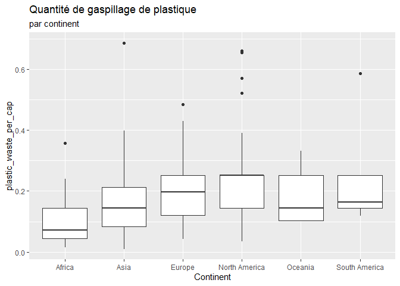
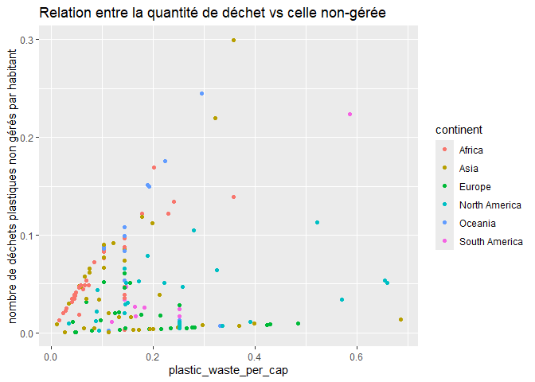
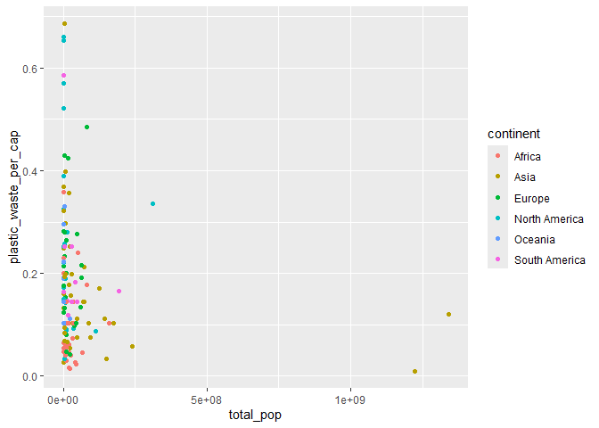
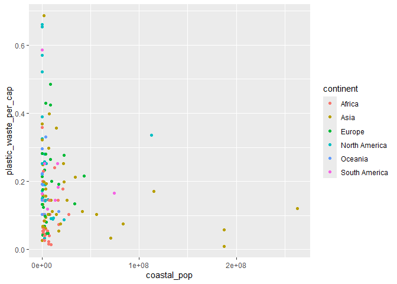
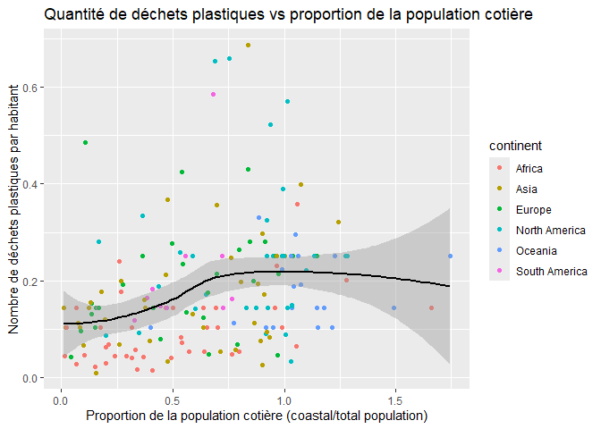

Lab 02 - Plastic waste
================
Emy Poirier
15 septembre 2025

## Chargement des packages et des données

``` r
library(tidyverse) 
```

``` r
plastic_waste <- read_csv("data/plastic-waste.csv")
```

``` r
ggplot(data = plastic_waste, aes(x = plastic_waste_per_cap)) +
  geom_histogram(binwidth = 0.2)
```

    ## Warning: Removed 51 rows containing non-finite outside the scale range
    ## (`stat_bin()`).

<!-- --> Commençons
par filtrer les données pour retirer le point représenté par Trinité et
Tobago (TTO) qui est un outlier.

``` r
plastic_waste <- plastic_waste %>%
  filter(plastic_waste_per_cap < 3.5)
```

## Exercices

### Exercise 1

``` r
ggplot(plastic_waste, aes(x = plastic_waste_per_cap)) +
  geom_histogram(binwidth = 0.25) +
  facet_wrap(~ continent)
```

<!-- -->

### Exercise 2

``` r
ggplot(plastic_waste, aes(x = plastic_waste_per_cap, colour = continent,
                          fill = continent)) +
  geom_density(adjust = 1,
               alpha = 0.4) +
  labs(
    x = "Plastic_waste_per_cap", 
    y = "Density",
    title = "Quantité de gaspillage de plastique",
    fill = "continent"
  )
```

<!-- -->

Les réglages de couleur (color et fill) ne se trouvent pas au même
endroit que celui de la transparence (alpha), car ils sont liés à
l’esthétique des données et du graphique. Tandis que, (alpha) est
indépendant aux données.

### Exercise 3

Boxplot:

``` r
ggplot(plastic_waste, aes( x = continent, y = plastic_waste_per_cap)) +
  geom_boxplot() +
  labs( 
    x = "Continent",
    y = "plastic_waste_per_cap", 
    title = "Quantité de gaspillage de plastique",
    subtitles = "par continent"
    )
```

<!-- -->

Violin plot:

``` r
ggplot(plastic_waste, aes(x = continent, y = plastic_waste_per_cap )) +
  geom_violin()
```

<!-- -->

Il nous permet d’avoir une meilleure visualisation des données.

### Exercise 4

``` r
ggplot(plastic_waste, aes(x = plastic_waste_per_cap, y = mismanaged_plastic_waste_per_cap, colour = continent)) +
  geom_point () +
  labs(title = "Relation entre la quantité de déchet vs celle non-gérée", y = "nombre de déchets plastiques non gérés par habitant")
```

<!-- -->

L’Asie sont ceux qui ont le plus de déchet mal gérés

### Exercise 5

``` r
ggplot(plastic_waste, aes(x = total_pop, y = plastic_waste_per_cap, colour = continent)) + 
  geom_point () 
```

    ## Warning: Removed 10 rows containing missing values or values outside the scale range
    ## (`geom_point()`).

<!-- -->

``` r
ggplot(plastic_waste, aes(x = coastal_pop, y = plastic_waste_per_cap, colour = continent)) +
  geom_point ()
```

<!-- -->

Il semble avoir une plus forte relation entre les variables du second
graphique.

## Conclusion

Recréez la visualisation:

``` r
plastic_waste_coastal <- plastic_waste %>%
  mutate(coastal_pop_prop = coastal_pop / total_pop) %>%
  filter(plastic_waste_per_cap < 3)
ggplot(plastic_waste_coastal, aes(x = coastal_pop_prop, y = plastic_waste_per_cap, color = continent)) + 
  geom_point() +
  geom_smooth(aes(group = 1), method = "loess", color = "black", se = TRUE) +
  labs(title = "Quantité de déchets plastiques vs proportion de la population cotière", x = "Proportion de la population cotière (coastal/total population)", y = "Nombre de déchets plastiques par habitant", color = "continent")
```

    ## `geom_smooth()` using formula = 'y ~ x'

    ## Warning: Removed 10 rows containing non-finite outside the scale range
    ## (`stat_smooth()`).

    ## Warning: Removed 10 rows containing missing values or values outside the scale range
    ## (`geom_point()`).

<!-- -->
