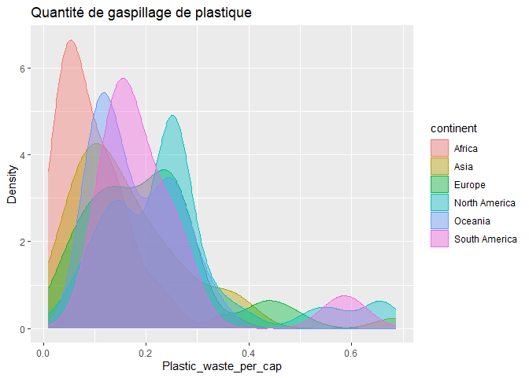

Lab 02 - Plastic waste
================
Emy Poirier
15 septembre 2025

## Chargement des packages et des données

``` r
library(tidyverse) 
```

``` r
plastic_waste <- read_csv("data/plastic-waste.csv")
```

``` r
ggplot(data = plastic_waste, aes(x = plastic_waste_per_cap)) +
  geom_histogram(binwidth = 0.2)
```

    ## Warning: Removed 51 rows containing non-finite outside the scale range
    ## (`stat_bin()`).

<!-- --> Commençons
par filtrer les données pour retirer le point représenté par Trinité et
Tobago (TTO) qui est un outlier.

``` r
plastic_waste <- plastic_waste %>%
  filter(plastic_waste_per_cap < 3.5)
```

## Exercices

### Exercise 1

``` r
ggplot(plastic_waste, aes(x = plastic_waste_per_cap)) +
  geom_histogram(binwidth = 0.25) +
  facet_wrap(~ continent)
```

<!-- -->

### Exercise 2

``` r
ggplot(plastic_waste, aes(x = plastic_waste_per_cap)) +
  geom_density()
```

<!-- -->

Réponse à la question…

### Exercise 3

Boxplot:

``` r
# insert code here
```

Violin plot:

``` r
# insert code here
```

Réponse à la question…

### Exercise 4

``` r
# insert code here
```

Réponse à la question…

### Exercise 5

``` r
# insert code here
```

``` r
# insert code here
```

Réponse à la question…

## Conclusion

Recréez la visualisation:

``` r
# insert code here
```
